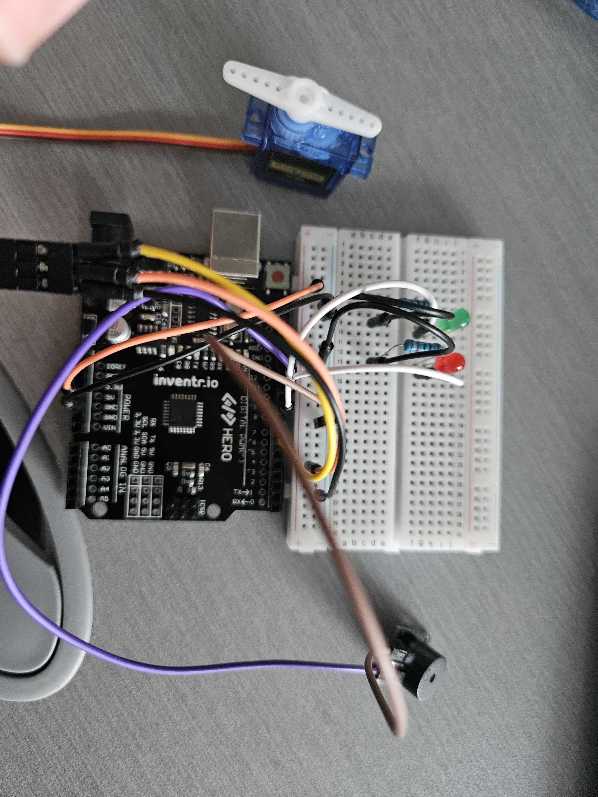

# Vault Door Lock

This project uses **serial input commands** to move a **servo motor**, acting like a door lock. When a valid command is input into the **serial monitor**; the **servo motor** will move, a **piezo buzzer** will sound, and one of the two **LEDs** will turn on.

---

## Components Used

| Component               | Quantity |
|------------------------|----------|
| Arduino Uno R3         | 1        |
| Breadboard             | 1        |
| Green LED                | 1        |
| Red LED                | 1         |
| 220Ω Resistors          | 2        |
| Jumper Wires           | 11      |
| Piezo Buzzer          | 1      |
| Servo Motor           | 1      |

---

## Installation & Setup

1. **Connect Power to the Bread Board**
   - 5V → Bread Board positive strip (+)
   - GND → Bread Board negative strip (-)
   
2. **Connect the LEDs**  
   - Green LED anode (+) → Digital Pin 13  
   - Green LED cathode (–) → 220Ω Resistor → GND
   - Red LED anode (+) → Digital Pin 12  
   - Red LED cathode (–) → 220Ω Resistor → GND

3. **Connect the Piezo Buzzer**  
   - Positive → Digital Pin 10  
   - Negative → GND

4. **Connect the Servo Motor**  
   - Signal(Yellow) → Digital Pin 9  
   - Power(Red) → 5V  
   - GND(brown or black) → GND

5. **Upload the Code**:
   - Open [Arduino IDE](https://www.arduino.cc/en/software/).
   - *Install the program if you don't already have it.*
   - Connect your Arduino Uno via USB.
   - Upload your `.ino` sketch.

6. **Serial Monitor Setup**:
   - Open the **Serial Monitor** (baud rate: **9600**).
   - Type commands to control the lock (see below).

---

## How It Works

- The system awaits commands via the **Serial Monitor**.
- **Serial Monitor Commands**:
  - `lock` – Locks the door:
    - Servo rotates to the closed position (90).
    - **Red LED** turns ON.
    - Buzzer beeps.
  - `unlock` – Unlocks the door:
    - Servo rotates to the open position (0).
    - **Green LED** turns ON.
    - Buzzer beeps.

---

## Images / Video

- 

---

## Simulation

> Use an online simulator like [Tinkercad](https://www.tinkercad.com/) to view the project simulation.

- [Tinkercad Simulation Link](https://www.tinkercad.com/things/6ofQ2lQ3Xhv-vault-door-lock?sharecode=ER8p8efbMsCqygsPO4usIu8K6g2ePpaM25RUcKq595I)

---

## Credits

- Project by: *Nat King*  
- Inspired by: Serial input commands and passcode door locks
- Libraries used:
  - `Servo.h`

---
